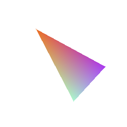

# RGB triangle generator (MIPS-32)
Mini-project for exploring MIPS assembly language.

The program draws a colorful triangle on white RGB24 pixelmap and saves it to file.  
Pixelmap dimensions, output file name and triangle's color and position are hardcoded in the first 16 lines of [rgb_triangle.asm](rgb_triangle.asm) ("USER-DEFINED SYMBOLS" section).  
Barycentric coordinate system is used in order to determine boundaries of the triangle and correctly mix colors. You can read more about this method [here](https://codeplea.com/triangular-interpolation).

The proper output image is presented below:  

The project was carried out as an assignment for CPU architecture-related subject.  
Make sure to check out its other incarnations: [x86/C version](https://github.com/Dove6/RGB-triangle-generator-x86), [x86-64/C version](https://github.com/Dove6/RGB-triangle-generator-x86-64).

## Running
The code is to be run using [MARS 4.5](http://courses.missouristate.edu/kenvollmar/mars/) MIPS assembler and simulator.
